# 🏪 Minimart Data Warehouse & Analytics


**End-to-End Data Engineering & Business Intelligence Project**

This project demonstrates a complete data pipeline solution for a retail minimart business with 3 branches (New York, Los Angeles, Chicago). It encompasses the entire data lifecycle from ingestion and advanced cleaning (ETL) to Star Schema modeling, Machine Learning segmentation, and interactive dashboard visualization.

The goal is to transform raw, messy transaction data into high-quality insights to drive business decisions.

## 🚀 Key Technical Highlights
* **Dimensional Modeling:** Designed a **Star Schema** using **SAP PowerDesigner** and implemented it on **MS SQL Server** for optimized query performance.
* **Advanced ETL Logic:** Engineered complex data cleaning rules using **Regex** and custom calculations in **Tableau Prep** to handle severe data quality issues.
* **Machine Learning Integration:** Applied **K-Means Clustering** via **Altair AI Studio (RapidMiner)** for customer segmentation based on RFM analysis.
* **Strategic Insights:** Uncovered critical sales anomalies (Failed Peak in Q4) through **Tableau Dashboards**.

---

## 🛠️ Tech Stack

| Category | Tool | Description |
| :--- | :--- | :--- |
| **Database** |  | Used for data warehousing and storing relational data. |
| **Data Modeling** |  | Used for designing conceptual, logical, and physical data models. |
| **ETL & Prep** |  | Used for cleaning, shaping, and combining data before analysis. |
| **Machine Learning** | -FF4B1F?style=for-the-badge&logo=rapidminer&logoColor=white) | Used for building predictive models and data mining. |
| **Visualization** |  | Used for creating interactive dashboards and business insights. |
---

## 🔄 System Architecture
The data pipeline flows from raw CSV ingestion through cleaning and modeling layers to final analytical consumption.

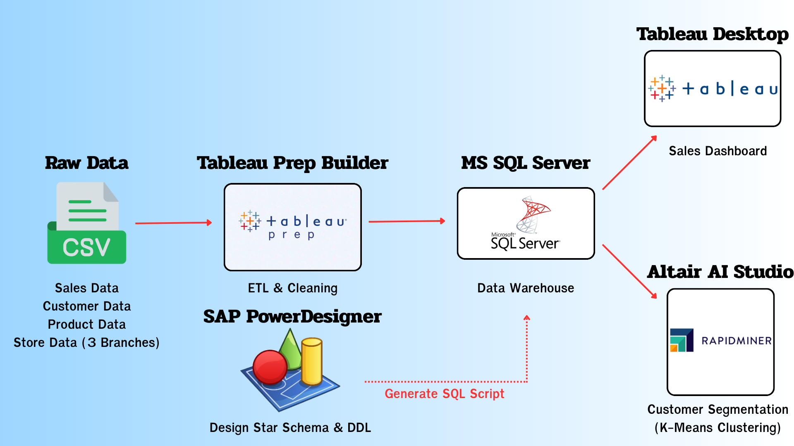

> *Note: **SAP PowerDesigner** was utilized to architect the Star Schema and generate DDL scripts for the **MS SQL Server** implementation.*

---

## 📂 1. Data Source & Quality Challenges
The raw dataset consists of **6 CSV files** simulating retail operations. Before processing, I performed a comprehensive data profiling audit and identified critical "Dirty Data" issues.

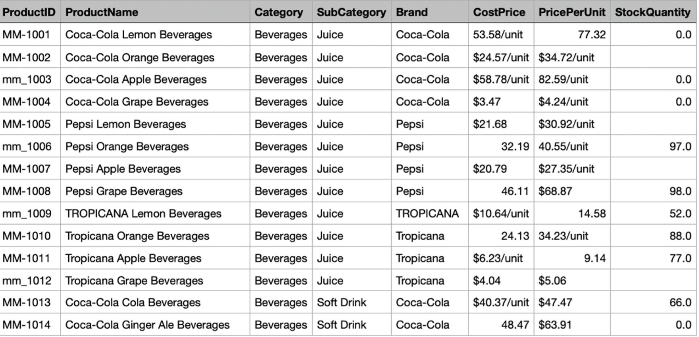
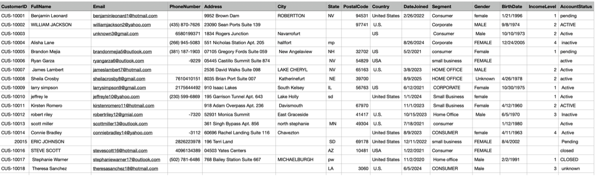
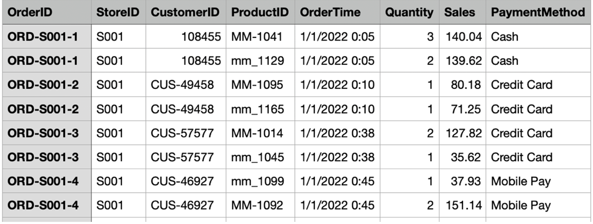
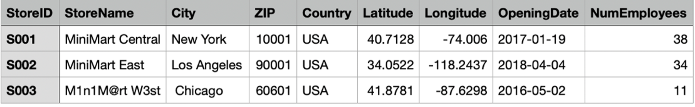

### 🚨 Critical Issues Log:
| Entity | Problem Detected | Impact |
| :--- | :--- | :--- |
| **DimCustomer** | **Invalid Emails:** Typos in domains (e.g., `@gmial.com`). | Communication failure rates. |
| **DimCustomer** | **Dirty Phone Numbers:** Contained special characters (e.g., `(555)-0199`). | Inconsistent contact formatting. |
| **DimProduct** | **String in Numeric Fields:** Costs included units (e.g., `$24.57/unit`). | Prevented mathematical aggregation. |
| **FactSales** | **Data Fragmentation:** Transactions split across 3 separate files. | Incomplete view of total sales. |

---

## 🏗️ 2. Data Modeling (Star Schema)
To ensure data integrity and optimize for analytical queries, I first designed the target data architecture using **SAP PowerDesigner** before implementing the ETL pipeline.


### Schema Design (MS SQL Server Implementation):
* **Fact Table:** `Fact_Sales`
    * *Grain:* One record per transaction line item.
    * *Measures:* Sales Amount, Profit, Quantity.
* **Dimension Tables:**
    * `Dim_Customer`: Customer demographics and membership info.
    * `Dim_Product`: Product hierarchy, brands, and unit costs.
    * `Dim_Store`: Branch locations and employee details.
    * `Dim_Time`: Date dimension for time-series analysis.

---

## ⚙️ 3. ETL & Data Preparation (Deep Dive)
**Tool Used:** Tableau Prep Builder

With the Star Schema defined, I engineered a robust ETL workflow to clean, transform, and load the raw data into the target model.

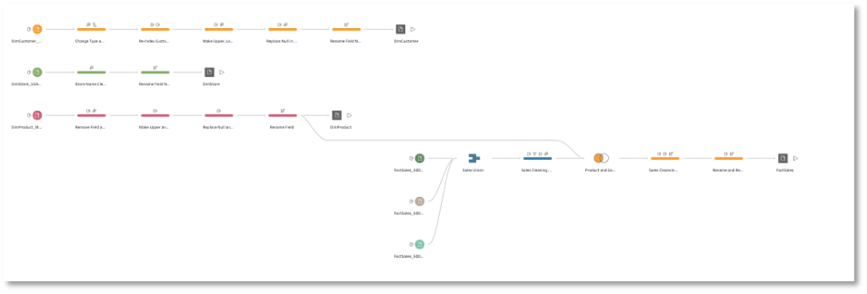

### 🧹 3.1 Customer Data Cleaning
* **Email Correction:**
    * *Logic:* `REPLACE([Email], 'gmial', 'gmail')`
* **Phone Number Normalization:**
    * *Logic:* Used **Regex** `REGEXP_REPLACE([PhoneNumber], "\D", "")` to remove non-digits.
* **Null Handling:**
    * *Logic:* Imputed missing `Date_Joined` with default `'2100-01-01'`.

### 🧹 3.2 Product Data Transformation
* **Unit Removal & Type Casting:**
    * *Logic:* `FLOAT(REPLACE(REPLACE([CostPrice], '$', ''), '/unit', ''))` to convert strings to numbers.
* **Brand Standardization:**
    * *Logic:* Applied `PROPER()` case and grouping to merge `BrandA` and `brandA`.

### 🧹 3.3 Sales Transaction Integration
* **Data Unification:**
    * Performed a **Union** of `FactSales_S001`, `S002`, and `S003`.
* **Calculated Fields:**
    * `Total Cost` = `[Quantity] * [CostPrice]`
    * `Profit` = `[Sales] - [Total Cost]`
* **Imputation:**
    * Recovered missing sales using `[Quantity] * [PricePerUnit]`.

### 🚛 3.4 Data Loading (Load)
* **Destination:** **Microsoft SQL Server**.
* **Mapping:** Mapped clean outputs directly to the `Fact` and `Dimension` tables defined in Section 2.
* **Integrity:** Loaded Dimensions first to satisfy Foreign Key constraints.
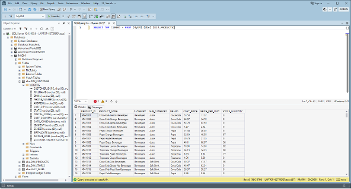
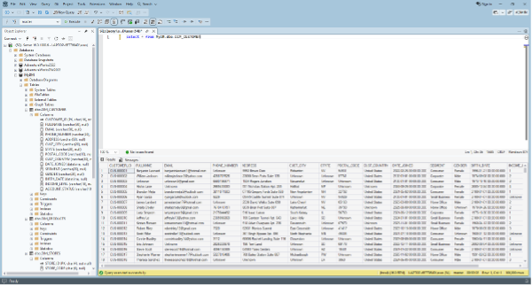
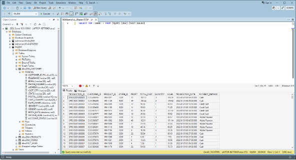
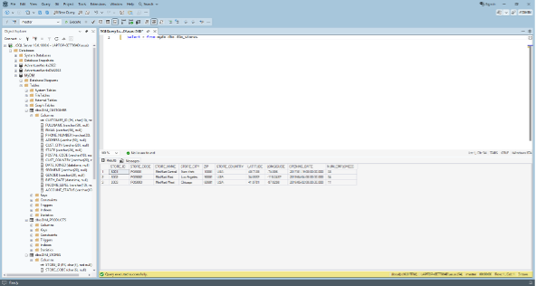
---

## 🧠 4. Machine Learning & Analytics
### Customer Segmentation (Clustering)
Utilized **K-Means Clustering** in **Altair AI Studio (RapidMiner)** to categorize customers based on RFM (Recency, Frequency, Monetary).

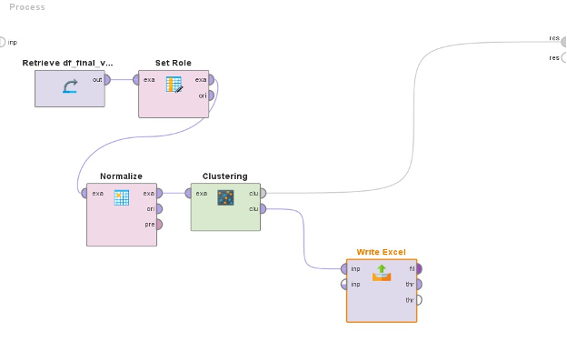

| Cluster | 🛒 Spending Behavior (Monetary & Frequency) | 🕒 Recency (Time since last visit) | 🏷️ Customer Segment |
| :---: | :--- | :--- | :--- |
| **Cluster 3** | 🟢 **Very High** (Top Spender) | 🟢 **Very Low** (Active recently) | **💎 VIP / Loyal Customers** |
| **Cluster 4, 5** | 🔴 **Low** | 🔴 **Very High** (Inactive > 6 months) | **💤 Dormant / Churn Risk** |
| **Cluster 0, 1, 2** | 🟡 **Moderate** | 🟡 **Moderate** | **🛒 Standard Customers** |

### 💡 Strategic Action Plan:
* **VIPs (Cluster 3):** Launch exclusive membership rewards to maintain loyalty.
* **Churn Risk (Cluster 4, 5):** Re-activate with "We Miss You" coupons or limited-time offers.
* **Standard (Cluster 0-2):** Focus on up-selling to increase basket size per visit.

---

## 📈 5. Business Dashboard
The final output is an interactive **Tableau Dashboard** designed for executive monitoring.

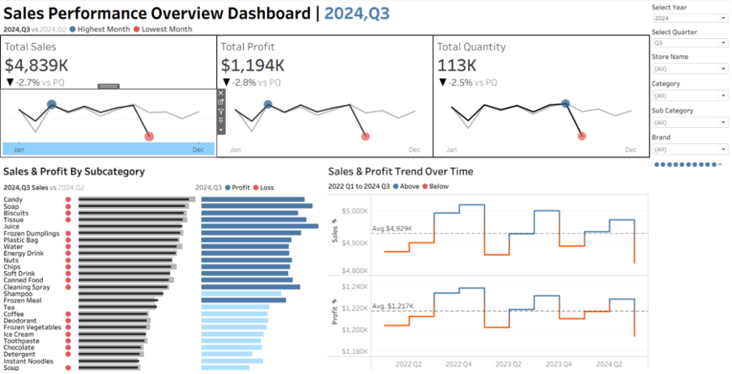

### 💡 Business Insights Discovered:
* **"Failed Peak" Alert:** Detected a **2.5% drop in Sales** during Q4 2023, contradicting expected seasonal trends.
* **Product Performance:** Identified top-performing product categories for inventory planning.

---

### 📁 Repository Structure
```text
├── assets/             # Images (Diagrams, Screenshots)
├── data/               # Sample dataset (Mock data)
├── sql/                # SQL DDL Scripts for Table Creation
├── etl/                # Tableau Prep Flow files (.tfl)
├── models/             # Altair/RapidMiner Process files (.rmp)
├── dashboards/         # Tableau Workbook files (.twbx)
└── README.md
